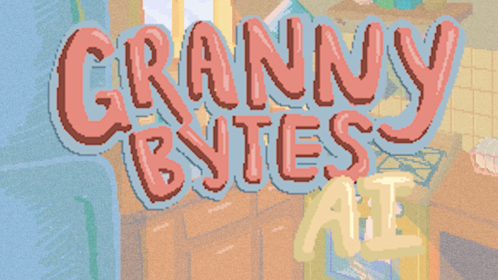
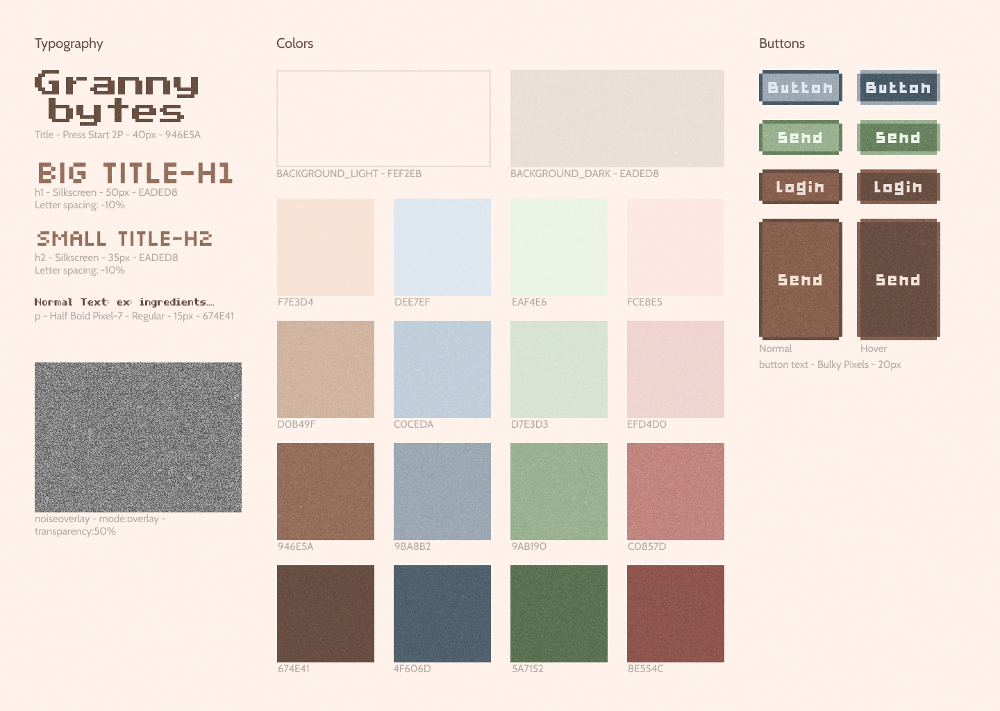

# Granny Bytes

[**Try Granny Bytes!**](https://granny-bytes.onrender.com/)

**Participated in 2024 [Google AI Hackathon!](https://googleai.devpost.com/)**

[Check out this project on Devpost!](https://devpost.com/software/project-name-tbd-tlwp7u)

**Granny Bytes is a web-based AI application that uses Google’s Gemini API to create a helpful and constructive Grandmother-inspired kitchen chatbot, engaging new technologies with traditional cooking.**

## Introduction
Granny Bytes is a project that explores *inter-generational connections* and how it can manifest within our interactions with technology.

Within this project we are researching the capabilities of AI and its potential relationship with both the elderly population and our (younger generation) interactions with them. AI is characterized by rapid advancement with each passing year, and can be considered one of the most groundbreaking technologies our modern world has welcomed.

On the other hand, with technology being such a new concept, there are many instances where the older generation are left behind in its wake, struggling to learn how to interact with the tools that power this current society.

And so, we wanted to create an interactive tool that reimagines the modernity of AI as a member of the pre-technology generation to foster a sense of familiarity and comfort for this population when interacting with an unfamiliar tool.

In addition, we were interested in seeing how this reimagination of *“Grandma”* via a technological reimagination could shift the kind of relationship that can be had between the younger and older generation.

***We believe Granny Bytes is the method for bridging the gap between the two, and also creating a sort of permanence for the fleeting nature defining this relationship.***

## Concept
Within the relationship of grandmothers and the youth, food is a big factor of unification, and so we decided to use cooking as the focus for mirroring this relationship– seeing how AI and cooking can be a facet of our humanity.

Granny Bytes helps you answer any questions you have as you cook recipes passed down through different generations.The four recipes listed are recipes from our grandmothers.

At the end you can also send an image of your cooking to know how well you cooked it and things you can improve on.

**Chat with Granny Bytes on your next cooking adventure.**

## Inspiration
Our inspiration stems from the personal relationships we all have with our grandmothers, and about the ways we can harness AI to emulate this inter-generational connection. 

Within the relationship between grandmothers and the youth, food is a big factor of unification, and so we decided to use cooking as the focus for mirroring this relationship– seeing how AI and cooking can be a facet of our humanity. 

As for the user experience, we were inspired by cozy 8-bit style games and retro computer interfaces: all of our assets having a pixelated characteristic and having the elements propped on a reimagination of the old Windows UI. 

## What it does
Our app simulates the experience of cooking with grandmothers, utilizing the AI capabilities of Gemini to imitate the grandmother's presence. 

As of now, users are presented with 4 pre-written cultural recipes that have been passed down by each team members’ grandmothers. 

When clicking on a recipe, users will be greeted with an interactive recipe guide with a section hosting the ingredients, the chat room where the grandmother will list the steps one at a time and have users type in any questions they have to which the grandmother will respond before proceeding to the next step, and a section where users can upload their final product for feedback by the AI powered grandmother.

## How we built it
* We first used Figma to create the general visualization, interactions, and assets of our app. 
#### Granny Bytes Style Sheet

#### Granny Bytes Flow Mock Up In Figma

* Procreate was used to create certain assets like the animated grandma gif and the visuals for each step of each recipe. 
#### Granny Bytes Steps Illustration 

* We are using google's gemini-pro and gemini-pro-vision model for the grandma chat and food image analysis respectively.
* HTML and CSS were used to translate the visuals to the front end. 
* JavaScript, Node.js, and Express.js, were used to build the web application's backend.

## Meet The Team
* Robin Altman: [Github](https://github.com/altrs), [Portfolio](https://www.altrs.wiki/)
* Chris Chang: [Github](https://github.com/chanc245), [Portfolio](https://chrisc.bio/)
* Paridhi Garg: [Github](https://github.com/Paridhii27), [Portfolio](https://www.paridhiworks.com/)
* Hannah Lee: [Github](https://github.com/hannahlee2021), [Portfolio](https://hl3e213works.cargo.site/)

## References
* [Gemini API](https://ai.google.dev/)
* [Node.js](https://nodejs.org/)
* [Express.js](https://expressjs.com/)
* [jquery.terminal](https://github.com/jcubic/jquery.terminal)
* [Dropzone.js](https://www.dropzone.dev/)

### Instructors
([Parsons School of Design](https://www.newschool.edu/parsons/))
* Jesse Harding 
* Tassneen Bashir
* Fei Liu
* Samuel Thurman
* Justin Bakse